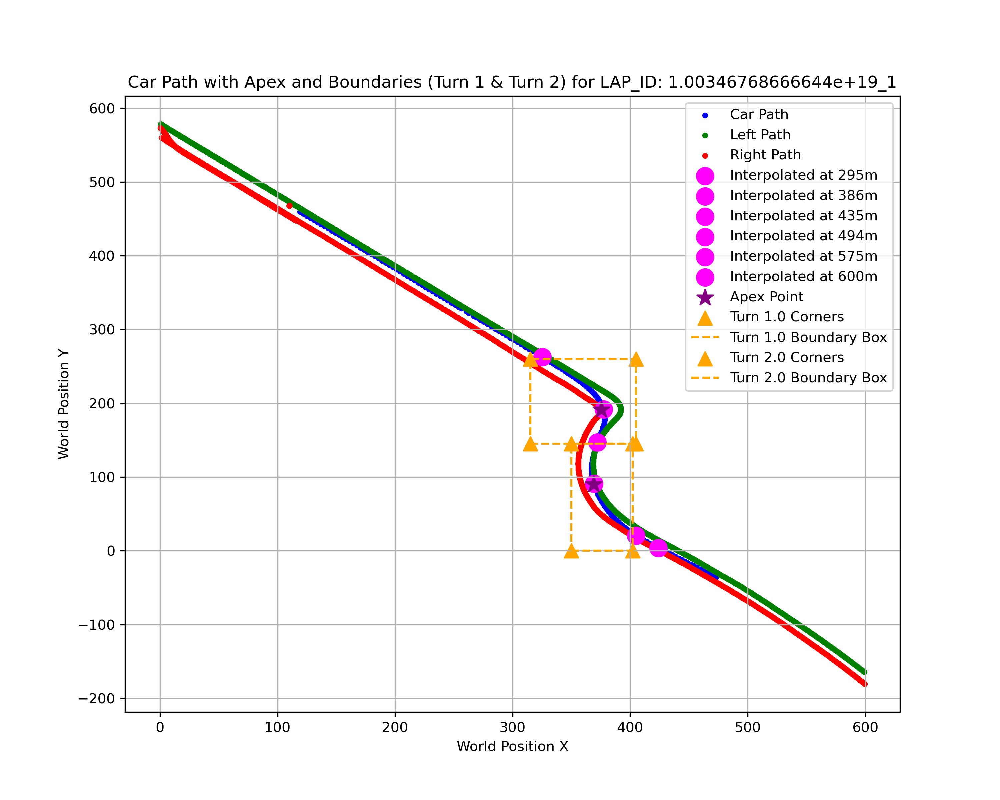

## Project Title: F1 Data Product

# Project Description:

# Main Objective 

To develop a comprehensive dataset using data collected in 2022, 2023 and 2024 from an F1 simulation by Oracle. This product will identify key variables that should be optimised to achieve an ideal lap time, specifically focusing on turns 1 and 2 on the race track.

# Significance  

F1 racing is becoming increasingly data-centric, with teams relying on extensive data to make strategic decisions and improve their performance. This data product will serve as a foundation for further modelling by identifying crucial factors such as braking point, turning points, and car positioning to maximise exit speed from turn 2. By leveraging these insights, teams can make informed decisions, giving their drivers a competitive edge on the track.

# Relation to  previous work 

In recent years, data analysis has become central to F1 racing, with teams leveraging Monte Carlo simulations and real-time data to improve their strategies for optimal performance. Previous efforts, particularly by teams like Oracle Red Bull Racing, have focused on collecting data related to variables such as speed, throttle, and steering inputs. Drivers like Max Verstappen use these advanced simulations to identify key factors that influence lap times and make adjustments accordingly.  
This project builds on Oracle’s existing data by introducing new variables and manipulating data to ultimately create a data framework. By expanding the dataset in this way, we aim to provide drivers with more detailed insights to make better-informed decisions and ultimately improve lap times. 

# Sources:

The data sources used to construct the data product are datasets provided by Oracle which contain records of variables recorded in an F1 simulation during the years 2022 - 2024. The data itself was produced via the EA F1 simulator in which various drivers raced around the track while information on relevant variables was recorded.  
The variables included in the 2022 and 2023 datasets will be used to construct data product are shown below.

| Variable       | Description | 
|:-----------|:----|
| SESSION_IDENTIFIER   |  Unique identifier for the session | 
| LAP_NUM |  Current lap number |
| LAP_DISTANCE  |  Distance vehicle is around current lap in metre | 
| CURRENT_LAP_TIME_MS  |  Current time around the lap in milliseconds |
| THROTTLE  |  Amount of throttle applied (0.0 to 1.0) |
| BRAKE  |  Amount of brake applied (0.0 to 1.0) |
| STEERING  |  Steering (-1.0 (full lock left) to 1.0 (full lock right)) |
| WORLDPOS X/Y  |  World space X/Y position |

Additional variables that were included in the 2024 are shown below along with their corresponding variable names:

| Variable       | Corresponding Variable | 
|:-----------|:----|
| SESSION_GUID   |  SESSION_IDENTIFIER | 
| M_CURRENTLAPNUM |  LAP_NUM |
| M_LAPDISTANCE_1  |  LAP_DISTANCE | 
| M_CURRENTLAPTIMEINMS_1  |  CURRENT_LAP_TIME_MS |
| M_THROTTLE_1  |  THROTTLE |
| M_BRAKE_1  |  BRAKE |
| M_STEER_1  |  STEERING |
| M_WORLDPOSITIONX_1/Y_1  |  WORLDPOS X/Y |
| STEERING  |  WORLDPOS X/Y |


# Workflow:
__1. Setting up our track of interest__  
The first step is to identify critical points within the lap, from the start of Turn 1, through Turn 2, to the finishing line. By plotting the first lap of the 2023 data, using the left and right side distances and corner coordinates, we identified five key points at 295m, 386m, 435m, 494m, 575m, and 600m (the new finishing line). These points are just before the boundary and apex of Turns 1 and 2, with 600m (a point between Turns 2 and 3). These points are crucial for modelling, as they capture significant insights like brake, throttle, steering and distances to the track edges.  
Below is the plot of critical points against the track path and turning points for better visualisation.  


__2. Combining 3 datasets__  
&nbsp;&nbsp;&nbsp;&nbsp;To ensure consistency and make the data easier to process, we first merged the 2022 and 2023 data files, as they shared the same variables and format. After merging, we kept only the variables necessary for modelling, which is described in the data description. Next, we integrated the 2024 data file, which had a different format and variable names. This required renaming and aligning the variables with those from the combined 2022 and 2023 dataset.

__3. Initial data cleaning__  
Once the data was merged, we performed initial data cleaning after taking all the columns, and dropped NaN values. The criteria for identifying if it is NaN is if the value is missing for columns where that value must be shown in numerical type, or the value for variable not is numerical type, such as string value. We also checked for any inconsistencies in the throttle and brake values as it needs to be between 0.00 to 1.00

__4. New lap ID variable__  
We created a new variable LAP_ID, by combining SESSION_ID and the LAP_NUMBER. Each unique LAP_ID represents an independent subset, ensuring that all data within each lap is treated as a separate observation in our data product.

__5. Data interpolation__  
To determine the throttle, brake and steering values for the chosen five critical points, linear interpolation was used. Due to the format of data files in 2022 and 2023, we do not have exact data information for those critical points, which is the reason behind our decision to use linear interpolation, as we need the two closest points to find the values for those critical points.

__6. Further Data cleaning__  
Since the lap distance at 600m is treated as a new finishing line, the finishing time at this point becomes a potential response variable. After producing the data, we’ll filter out any rows with NaN values for finishing time at 600m, though some NaN values for other variables will remain for modellers to handle later as these laps could still provide valuable information. The missing data for finishing time at 600m is due to insufficient data for interpolation, which requires two points (before and after the target point). For example, if the lap distance data goes up to 1000m but the critical point is at 600m, and there is no point close enough after 600m, interpolation becomes unreliable. This issue also affects other critical points with large gaps in lap distance. 

__7. Is the lap valid?__  
We created a new variable, ‘TRACK_VALID’, which determines whether a lap is valid or invalid. A lap is considered valid if the car stays on track throughout. To check this, we first find the two nearest points on both the left and right edges of the track for each car position. Then, we calculate the distance from the car to both edges. If the car’s distance from either side is within the width of the track (plus a 1 metre buffer for the car’s width), the lap is marked as valid. However, if all four wheels of the car are off the track—meaning it crosses the boundary on either side—the lap is considered invalid.

# Data description:

This dataset contains 1272 rows, each representing a lap in the F1 racing simulator for the Albert Park race track, covering data from 2022,2023 and 2024. A unique identifier for each lap, lap_id was created by combining the session ID and lap number.

The key variables of interest are:  
&nbsp;&nbsp;&nbsp;&nbsp;&nbsp;&nbsp;&nbsp;&nbsp;- Output Variables:  
&nbsp;&nbsp;&nbsp;&nbsp;&nbsp;&nbsp;&nbsp;&nbsp;&nbsp;&nbsp;&nbsp;&nbsp;+ _FINISHING_TIME_AT_600_: The total time (in milliseconds) taken to complete 600 meters of the lap.  
&nbsp;&nbsp;&nbsp;&nbsp;&nbsp;&nbsp;&nbsp;&nbsp;&nbsp;&nbsp;&nbsp;&nbsp;+ _TRACK_VALID_: Categorical variable indicating whether the lap was ‘valid’ or ‘invalid’.  
&nbsp;&nbsp;&nbsp;&nbsp;&nbsp;&nbsp;&nbsp;&nbsp;- Input Variables:  
&nbsp;&nbsp;&nbsp;&nbsp;&nbsp;&nbsp;&nbsp;&nbsp;&nbsp;&nbsp;&nbsp;&nbsp;+ Throttle, brake and steering values recorded at specific distances along the lap (eg. 295m, 386m, 435m, 494m, 575m).

Additionally, the dataset includes features such as the distance to the left and right sides of the track at these specific points, which help predict the car’s position. These distances determine if the car stayed on track, veered left or veered right during the lap, ultimately assessing whether the lap was valid or invalid.

| Variable       | Description | 
|:-----------|:----|
| LAP_ID   |  Unique identifier for each lap, formed by combining the session ID and lap number | 
| LBRAKE_AT_[distance] |  The amount of braking (0.0 to 1.0) applied at that specific distance (i.e 295m, 386m, 435m, 494m, 575m) |
| THROTTLE_AT_[distance]  |  The amount of throttle (0.0 to 1.0) applied at that specific distance (i.e 295m, 386m, 435m, 494m, 575m) | 
| STEERING_AT_[distance]  |  Steering angle (-1.0 for full lock left to 1.0 for full lock right) recorded at specific distances (i.e 295m, 386m, 435m, 494m, 575m) |
| LEFT_DISTANCE_AT_[distance]  |  Distance from the car to the left side of the track, calculated using interpolation, recorded at specific distances (i.e 295m, 386m, 435m, 494m, 575m) |
| RIGHT_DISTANCE_AT_[distance]  |  Distance from the car to the right side of the track, calculated using interpolation, recorded at specific distances (i.e 295m, 386m, 435m, 494m, 575m) |
| FINISHING_TIME_AT_600  |  The total time (in milliseconds) taken to complete 600 meters of the lap |
| TRACK_VALID  |  Indicates whether the lap was classified as 'valid' or 'invalid' |

# Usage:

This dataset is designed for future data modelling, to help racers optimise their performance by simulating various scenarios. Specifically, it can be used to find the optimal amount of steering, throttle, and brake during the critical first two turns of the race track to minimise overall lap time.  Since we have two different output variables, including _FINISHING_TIME_AT_600_ and _TRACK_VALID_, we can use several different models to analyse and understand the realationship between the responses and predictors. A simple analysis model that can be used to analyse data is the linear regression for the response variable, _FINISHING_TIME_AT_600_. 

```python
import pandas as pd
import statsmodels.api as sm

# Load the final data
data = pd.read_csv('/Users/chris/Downloads/data-2/data_product_final_4.csv')

# Prepare the predictor
X = data.drop(columns = ['LAP_ID', 'TRACK_VALID', 'FINISHING_TIME_AT_600'])

# Define the response variable
y = data['FINISHING_TIME_AT_600']

# Drop NaN values from predictors and ensure y aligns
X = X.dropna()
y = y[X.index]

# Add a constant to the model (intercept term)
X = sm.add_constant(X)

# Fit the linear regression model 
model = sm.OLS(y, X).fit()

# Observe the summary of the model
summary = model.summary()
print(summary)
```
```markdown
                              OLS Regression Results                             
=================================================================================
Dep. Variable:     FINISHING_TIME_AT_600   R-squared:                       0.358
Model:                               OLS   Adj. R-squared:                  0.345
Method:                    Least Squares   F-statistic:                     27.22
Date:                   Thu, 10 Oct 2024   Prob (F-statistic):           2.25e-99
Time:                           18:32:54   Log-Likelihood:                -12190.
No. Observations:                   1248   AIC:                         2.443e+04
Df Residuals:                       1222   BIC:                         2.457e+04
Df Model:                             25                                         
Covariance Type:               nonrobust                                         
=========================================================================================
                            coef    std err          t      P>|t|      [0.025      0.975]
-----------------------------------------------------------------------------------------
const                  2.261e+04   1393.457     16.224      0.000    1.99e+04    2.53e+04
BRAKE_AT_295          -1655.1225    481.792     -3.435      0.001   -2600.353    -709.892
THROTTLE_AT_295         500.6824    752.035      0.666      0.506    -974.740    1976.105
STEERING_AT_295         330.4908   1916.553      0.172      0.863   -3429.609    4090.590
LEFT_DISTANCE_AT_295    -41.0909     34.379     -1.195      0.232    -108.540      26.358
RIGHT_DISTANCE_AT_295  -131.3528     42.342     -3.102      0.002    -214.424     -48.282
BRAKE_AT_386            152.8279    559.447      0.273      0.785    -944.755    1250.411
THROTTLE_AT_386          73.9793    477.957      0.155      0.877    -863.728    1011.687
STEERING_AT_386        -712.5994    613.457     -1.162      0.246   -1916.145     490.946
LEFT_DISTANCE_AT_386   -233.8839     49.026     -4.771      0.000    -330.069    -137.699
RIGHT_DISTANCE_AT_386   279.0048     44.885      6.216      0.000     190.945     367.065
BRAKE_AT_435           1995.5955   1442.364      1.384      0.167    -834.189    4825.380
THROTTLE_AT_435         926.3384    539.157      1.718      0.086    -131.437    1984.114
STEERING_AT_435       -3120.3879    704.265     -4.431      0.000   -4502.091   -1738.685
LEFT_DISTANCE_AT_435    302.0748     46.721      6.466      0.000     210.413     393.736
RIGHT_DISTANCE_AT_435   -49.4749     48.596     -1.018      0.309    -144.816      45.866
BRAKE_AT_494           2617.1758   2090.370      1.252      0.211   -1483.936    6718.288
THROTTLE_AT_494       -3365.1653    660.208     -5.097      0.000   -4660.432   -2069.899
STEERING_AT_494        -890.6069    826.856     -1.077      0.282   -2512.822     731.608
LEFT_DISTANCE_AT_494    114.2674     44.036      2.595      0.010      27.872     200.663
RIGHT_DISTANCE_AT_494  -136.2133     42.239     -3.225      0.001    -219.083     -53.343
BRAKE_AT_575           4031.4445   5057.082      0.797      0.425   -5890.080     1.4e+04
THROTTLE_AT_575       -2949.1332    671.250     -4.393      0.000   -4266.064   -1632.203
STEERING_AT_575        1445.2232    920.385      1.570      0.117    -360.488    3250.934
LEFT_DISTANCE_AT_575    -38.8733     60.954     -0.638      0.524    -158.460      80.713
RIGHT_DISTANCE_AT_575  -146.8068     50.411     -2.912      0.004    -245.709     -47.904
==============================================================================
Omnibus:                     1298.242   Durbin-Watson:                   1.914
Prob(Omnibus):                  0.000   Jarque-Bera (JB):            98684.339
Skew:                           4.898   Prob(JB):                         0.00
Kurtosis:                      45.448   Cond. No.                     1.32e+03
==============================================================================

Notes:
[1] Standard Errors assume that the covariance matrix of the errors is correctly specified.
[2] The condition number is large, 1.32e+03. This might indicate that there are
strong multicollinearity or other numerical problems.
```
In terms of using _TRACK_VALID_ as a response variable, the logistic regression model is advised to use in this case

```python
import pandas as pd
import statsmodels.api as sm
from sklearn.preprocessing import LabelEncoder

# Load the final data
data = pd.read_csv('/Users/chris/Downloads/data-2/data_product_final_4.csv')

# Prepare the predictor
X = data.drop(columns = ['LAP_ID', 'TRACK_VALID', 'FINISHING_TIME_AT_600'])

# Encode 'TRACK_VALID' (the response variable) as binary (0 for 'invalid', 1 for 'valid')
le = LabelEncoder()
data['TRACK_VALID'] = le.fit_transform(data['TRACK_VALID'])

# Define the response variable
y = data['TRACK_VALID']

# Drop NaN values from predictors and ensure y aligns
X = X.dropna()
y = y[X.index]

# Add a constant to the model (intercept term)
X = sm.add_constant(X)

# Fit the logistic regression model
logit_model = sm.Logit(y, X).fit()

# Observe the summary of the model
summary = logit_model.summary()
print(summary)
```
```markdown
Optimization terminated successfully.
         Current function value: 0.491175
         Iterations 8
                           Logit Regression Results                           
==============================================================================
Dep. Variable:            TRACK_VALID   No. Observations:                 1248
Model:                          Logit   Df Residuals:                     1222
Method:                           MLE   Df Model:                           25
Date:                Thu, 10 Oct 2024   Pseudo R-squ.:                  0.2902
Time:                        18:52:14   Log-Likelihood:                -612.99
converged:                       True   LL-Null:                       -863.60
Covariance Type:            nonrobust   LLR p-value:                 4.272e-90
=========================================================================================
                            coef    std err          z      P>|z|      [0.025      0.975]
-----------------------------------------------------------------------------------------
const                     3.9171      0.853      4.594      0.000       2.246       5.588
BRAKE_AT_295              0.1628      0.277      0.588      0.557      -0.380       0.706
THROTTLE_AT_295           0.1983      0.463      0.429      0.668      -0.708       1.105
STEERING_AT_295           0.5937      1.221      0.486      0.627      -1.799       2.987
LEFT_DISTANCE_AT_295      0.0323      0.022      1.492      0.136      -0.010       0.075
RIGHT_DISTANCE_AT_295     0.0687      0.028      2.471      0.013       0.014       0.123
BRAKE_AT_386             -1.0871      0.322     -3.381      0.001      -1.717      -0.457
THROTTLE_AT_386          -0.3459      0.275     -1.259      0.208      -0.884       0.192
STEERING_AT_386          -1.2089      0.360     -3.362      0.001      -1.914      -0.504
LEFT_DISTANCE_AT_386     -0.1143      0.031     -3.741      0.000      -0.174      -0.054
RIGHT_DISTANCE_AT_386    -0.0761      0.029     -2.660      0.008      -0.132      -0.020
BRAKE_AT_435              0.8557      0.989      0.865      0.387      -1.083       2.794
THROTTLE_AT_435           1.2135      0.315      3.854      0.000       0.596       1.831
STEERING_AT_435           0.9452      0.492      1.923      0.055      -0.018       1.909
LEFT_DISTANCE_AT_435     -0.0780      0.037     -2.120      0.034      -0.150      -0.006
RIGHT_DISTANCE_AT_435    -0.3220      0.035     -9.090      0.000      -0.391      -0.253
BRAKE_AT_494              1.6454      1.335      1.232      0.218      -0.972       4.263
THROTTLE_AT_494           1.2436      0.397      3.136      0.002       0.466       2.021
STEERING_AT_494           1.2041      0.585      2.058      0.040       0.058       2.351
LEFT_DISTANCE_AT_494      0.1616      0.029      5.542      0.000       0.104       0.219
RIGHT_DISTANCE_AT_494     0.0497      0.029      1.733      0.083      -0.007       0.106
BRAKE_AT_575              0.0854      3.296      0.026      0.979      -6.374       6.545
THROTTLE_AT_575           0.2790      0.417      0.669      0.503      -0.538       1.096
STEERING_AT_575           0.2591      0.647      0.401      0.689      -1.009       1.527
LEFT_DISTANCE_AT_575     -0.0332      0.040     -0.837      0.403      -0.111       0.045
RIGHT_DISTANCE_AT_575    -0.0275      0.034     -0.819      0.413      -0.093       0.038
=========================================================================================
```
_Support Info:_

Contact Hoang Hung Le via email - z5426796@ad.unsw.edu.au

# Contributors: 

Hoang Hung Le, Trishanti Karki, Mamun Khan, Zhaoxuan Liu and Honoka Kobayashi.  
Dataset provided by Oracle

_How can others get involved?_ 

Others can get involved by joining the github repository, sharing feedback and contributing through pull requests. All forms of collaboration are welcome, including others reporting issues, suggesting improvements or contributing code. 


